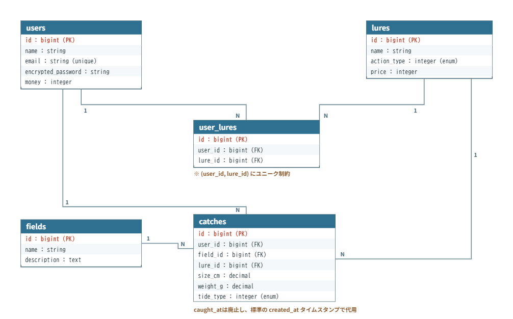

# シーバスカップ

個人開発 卒業制作企画書

---

## 1. サービス概要

アクション型ルアー釣りゲーム『シーバスカップ』。

釣れる魚種はシーバス（スズキ）のみに特化し、単一魚種を深く掘り下げるルアー釣り体験を提供する。

天候や時間の都合で実際に釣りへ行けないルアー釣り経験者が、ルアーで魚を誘う流れとヒット後の駆け引きを、ブラウザで手軽に疑似体験できるサービスである。

---

## 2. このアイデアはどこから生まれたか

### 2-1. きっかけとなった体験・感情

釣りをしながら、ポケモンやあつもり等の釣りのミニゲームや、ゲームセンターなどの釣りのゲームは餌釣り型しかないことに気づき、「なぜ、ルアーなどを使用した釣りのゲームはないのか」という疑問を持った。そこで自分で作ってみようと考えた。

### 2-2. なぜそれが「気になった」のか

趣味が釣りであり、餌釣りではなくルアーしか使わずに釣りをしている。また、ゲームも好きなため、雨で釣りに行けない等の状態でも手軽に疑似体験できるよう、この二つを合体させたいと考えた。

---

## 3. 課題の整理（表面的になっていないか）

### 3-1. 表に見えている困りごと

悪天候や仕事・家庭の都合で釣りに行けないとき、既存の釣りゲームの多くは餌釣り型が中心で、ルアーを操作して魚を誘う感覚を十分に感じられない。

### 3-2. 本当に解決したい課題は何か

ルアー釣りが好きな人が、天候や時間の都合で実際に釣りに行けないときに、既存の釣りゲームでは餌釣り型が中心で、ルアーを操作して魚を誘い、駆け引きをする感覚を味わえない。その結果、行けない期間が続くと、ルアー操作の感覚や勘が鈍ってしまう。

- **なぜ？** 既存の釣りゲームの多くは餌釣り型で、ルアーの操作性や魚との駆け引きを再現していないため
- **なぜ？** 天候や仕事・家庭の都合で釣りに行けない期間は、ルアー釣りが好きな人であれば誰にでも起こりうるため
- **なぜ？** ルアー釣りは、巻き方やタイミングなどの操作感覚を維持することが上達・満足感につながるため

→ **本当に解決したい課題**：既存の釣りゲームでは味わえない「ルアーで魚を誘い、駆け引きする」感覚を、釣りに行けない期間でも手軽に味わえるようにすること

### 3-3. 大切にしたい「リアルな釣り体験」

リアルさには様々な種類があるが、このゲームでは以下の2点を最も大切にする。

- **ルアー操作による「誘い」のリアルさ**：ルアーの動かし方（巻き方・速度・止め・トゥイッチなど）によって、シーバスの反応（バイト率）が変わること
- **ファイトにおける「駆け引き」のリアルさ**：魚の引きに応じてラインテンションを保ちながらリールを巻く駆け引き

魚種の多さ、潮汐、天候による釣果変化などは今回は優先度を下げ、まずは「誘う→駆け引きする」というコア体験の完成度を優先する。

---

## 4. 想定ユーザーについて

### 4-1. 想定しているユーザー

**注意：ターゲットは狭く絞る。**

「釣り好きな人」のような広いターゲットでは、誰の課題も解決できないアプリになりがちなため、以下のように1人の顔が思い浮かぶレベルまで絞り込んだ。

- **年齢**：20代
  - **理由**：学業や社会人生活が忙しくなり、学生時代のように自由に釣りへ行ける時間が減っていく年代であるため

- **生活・状況**：平日は学業や仕事があり、週末も天候や予定の都合で釣行できない週があるルアー釣り経験者
  - **理由**：「行きたいのに行けない」状況が定期的に発生し、その隙間を埋める疑似体験へのニーズが生まれやすいため

- **環境**：自宅や外出先でPCのブラウザに日常的に触れている
  - **理由**：アプリを使うかどうかの分かれ目になるハードル（インストールの手間など）を、ブラウザで完結させることで解消できるため

※上記は現時点の仮説であり、年齢・生活状況は開発者自身の状況に近い設定にしている。今後のヒアリングやテストプレイで調整する。

### 4-2. 自分とユーザーの距離

以下のうち、最も近いものは**「自分自身」**である。

開発者自身が想定ユーザーの一人であり、自分がこんな釣りゲームがあれば遊びたいと考えたことが、この企画の出発点になっている。

### 4-3. 実際に使われる可能性について（需要・存在確認）

このアプリを、「実際に使う人がいそうか」という視点で整理すると以下の通りである。

- **まず最初に使ってくれそうな人は誰か**：ルアー釣りが好きな人
- **その人は、どんな場面でこのアプリを思い出すか**：釣りがしたいが、雨などで行けないとき
- **今の生活の中で、代わりに使っているものは何か**：既存の釣りゲーム、屋内釣り堀
- **それを置き換えてまで使う理由はあるか**：既存のゲームにはないルアー操作・駆け引きのシステムがあること

### 4-4. ユーザーがサービスを導入して利用するまでのイメージ（導入・継続の流れ）

- **どんな場面・困りごとがきっかけで、このサービスを知る・思い出すか**
  - 雨などで釣りができないときや、既存の釣りゲームに飽きてきたとき

- **最初の一歩（登録・導入）で、ユーザーは何をする必要があるか**
  - アカウント作成などの導入コストをかけず、ブラウザですぐにプレイできるようにする（釣具などの特典よりも、参入のしやすさを優先する）
  - ※この方針はMVP〜初期段階のものであり、本リリースで換金・ルアー購入といった資産をユーザーに紐づける段階では、簡易な会員登録（認証）を導入する方向に見直す（詳細は10章）

- **利用を続ける理由は何か（習慣・必要性・価値）**
  - 釣りのイメージトレーニングとして機能すること

---

## 5. 既存サービス・競合調査

### 5-1. 似たサービスの調査

- **サービス名**：釣りスピリッツ
- **URL**：https://trsp.bn-am.net/
- **どんなことができるか**：餌つりで実際にリールを回すことで、よりリアルな釣り体験ができる

「ルアー釣りのゲームがない」と考えていたが、追加で調査したところ、ルアー操作を扱うゲーム自体は主にコンソール・モバイル向けに存在する。

- **サービス名**：Rapala Fishing Pro Series（Xbox/PS向け）
  - **どんなことができるか**：フィンランドの実在ルアーメーカー監修で、ルアーの選択とアピール（誘い）コマンドによって魚の反応が変わる

- **サービス名**：THE バスフィッシング（Nintendo Switch）
  - **どんなことができるか**：Joy-Conのモーション操作でロッド・リールを再現し、オンライン大会機能もある本格志向のブラックバス釣りゲーム

- **サービス名**：バスフィッシング3DⅡ（モバイルアプリ）
  - **どんなことができるか**：3Dグラフィックでルアーアクションやライバルとの釣果対決ができる、世界1400万DL超のバス釣りゲーム

これらはいずれもコンソールまたはモバイルアプリが中心で、インストール不要ですぐ遊べるブラウザゲームとしてルアー釣り（特に単一魚種に絞って駆け引きを深く再現するもの）を提供しているものは見当たらなかった。

### 5-2. それでも自分が作りたい理由

- **なぜ満足できなかったのか**
  - 釣りスピリッツはリアルな釣り体験ができるが餌釣りが中心。Rapalaやバスフィッシング3DⅡなどルアーを扱うゲームもあるが、コンソールの購入やアプリのインストールが必要で、雨の日にふと思い立ってすぐ遊べるものではない。

- **どこに違和感があったのか**
  - 多くのルアー釣りゲームは魚種やフィールドの豊富さを売りにしており、1つの魚（シーバス）とじっくり駆け引きすることに焦点を当てたものが見当たらない。

### 5-3. 差別化を「体験価値」で表現する

このアプリは、**【実際に釣りへ行けないルアー釣り経験者】の【天候や時間の都合でルアー釣りに行けない瞬間】を一番助けるアプリ**である。

**私のアプリの差別化ポイント**

- 従来の餌釣り型ではなくルアーを使用した釣り型にすることで、システムが区別化されている。それにより、ルアー釣りをする人に、誘いと駆け引きのリアル感があるゲームとなる。
- Rapalaやバスフィッシング3DⅡなど既存のルアー釣りゲームはコンソールの購入やアプリのインストールが必要だが、本アプリはブラウザですぐに遊べるため、行けない日にふと思い立ったときに気軽に疑似体験できる。
- 魚種をシーバス一種に絞ることで、対象魚をあれこれ広げずに、シーバスならではのルアーアクションや引きの駆け引きを深く再現することに集中できる。

---

## 6. このサービスで提供したい価値

### 6-1. ユーザーの変化

このサービスを使うことで、ユーザーは以下のように変化する。

- **行動の変化**：天候や時間の都合でルアー釣りに行けないときも、ルアーで魚を誘う流れやヒット後の駆け引きを楽しめるようになる
- **気持ちの変化**：釣りに行けないもどかしさが、疑似体験による満足感やリフレッシュに変わる
- **考え方の変化**：「釣りに行けない日＝釣りができない日」ではなく、「疑似的に楽しめる日」という捉え方に変わる

### 6-2. 価値を一文で表す

**このサービスは、ルアー釣りが好きな人が、シーバスルアー釣りをより手軽に疑似体験できるようになるサービスである。**

---

## 7. このアプリで実現すること

### 操作仕様（たたき台）

対象プラットフォームはPC（キーボード中心）とし、Enterキーを主操作としつつ、判別が曖昧になりやすい操作は事前に別キーへ分ける。

- **キャスト**：Enterキーを押しっぱなしでパワーゲージが溜まり、離した瞬間にキャスト。飛距離はゲージの溜まり具合で決まる
- **リトリーブ（巻く）**：Enterキーを連打する速さがそのままリール速度になる
- **停止（ステイ）**：Enterキーを押さずにいる間はルアーが静止する
- **トゥイッチ**：Spaceキーを1回押すとルアーが跳ねる（連打によるリトリーブと単発の短押しであるトゥイッチは、Enterキー1つでは区別が曖昧になりやすいため、事前に別キーへ分ける）
- **バイト判定**：ルアーの動かし方（速度・止め・トゥイッチのタイミング）によってシーバスのバイト率が変わる。バイトの兆候は、魚影がルアーに近づく演出・水面の波紋・効果音（バイト音）で知らせる
- **フッキング**：バイトの合図が出てから一定時間内（例：0.3〜0.5秒）にEnterキーを押すとフッキング成功。タイミングを外すとバラシ（ゲーム側が「バイト待ち」の状態を把握しているため、同じEnterキーでも文脈で判定できる）
- **ファイト（ラインテンション）**：フッキング後はEnterキーの連打でリールを巻きつつ、シーバスの引きに応じてテンションゲージが変動する。テンションが高すぎる状態で巻き続けるとラインブレイクでバラシ、逆に緩めすぎる状態が続くと針が外れてバラシになる
- **キャッチ条件**：テンションを適正範囲に保ちながら、シーバスの体力ゲージをゼロにする
- **結果演出**：キャッチ時はサイズ・重さを表示し、水しぶきや達成音などのフィードバックを入れる

### 「シーバスカップ」らしい要素（大会感）

- **制限時間**：例として3分間のタイムアタックで、その間に何匹・どれだけのサイズを釣れるかを競う
- **サイズスコア**：釣ったシーバスのサイズを得点化し、合計スコアを算出する
- **自己ベスト**：最大サイズ・合計スコアの自己ベストを記録し、プレイ後に比較表示する（MVPの段階ではRails + DBを使わず、ブラウザ内の保存機能だけで実現する。アカウントに紐づけた記録として本格的に永続化するのは、認証を導入する本リリース以降とする）

上記はたたき台のため、実際にプロトタイプで触ってみて調整する前提とする。特に、キャスト（押しっぱなし）・リトリーブ（連打速度）・フッキング（タイミング押し）・テンション（押す/離す）というEnterキーに残した複数の入力パターンについても、システム側で確実に区別・判定できるかをプロトタイプで確認し、必要であればさらにキーを分ける。

### MVPで作る機能

3-3で決めた「誘い」と「駆け引き」の2つのリアルさを検証できる、最小限の構成にする。

- 釣り場は1か所
- 魚種はシーバス1種のみ
- ルアーは1種類のみ
- キャスト機能（ルアーを投げる）
- ルアーを巻く操作（リトリーブ。速度や止めなど、最低限の「誘い」の操作入力）
- シーバスが食いつくかどうかの判定（ルアーの動かし方によってバイト率が変わる仕組み）
- フッキング操作（食いついた瞬間に合わせるタイミング操作）
- 簡単なファイト（引きに応じてリールを巻く／ラインテンションを保つ駆け引き）
- キャッチ or バラシ（逃げられる）の結果表示
- おおよその操作説明（チュートリアルは簡易な導線でよい）

### MVPで確認したいこと（対応する機能とセットで検証する）

- **リトリーブ操作（巻く・止める・トゥイッチ）**：ルアーを動かすこと（誘い）自体が楽しいかを確認する
- **バイト判定の仕組み（ルアーの動かし方によるバイト率の変化）**：食いつくまでの間延び感がないかを確認する
- **フッキング操作とファイト（ラインテンション）**：フッキングやファイトに適度な緊張感があるかを確認する
- **キャストからキャッチ／バラシ・結果表示までの一連のコアループ**：もう一度遊びたいと思えるかを確認する

### 本リリースで作る機能

MVPで検証できたコア体験に、幅と継続要素を追加する。この段階からRails + PostgreSQLの本格的な実装（永続化・API）に着手する。

- 簡易な会員登録（認証）：捕獲記録や資産（お金・所持ルアー）をユーザーに紐づけるために導入する
- ルアー／タックルの種類を複数に増やす（動かし方や見た目の違い）
- 場所ごとのシーバスの反応設定（河口・堤防など、複数フィールド）
- 大潮や中潮、小潮などの設定による釣れやすさの変化
- 捕獲記録（サイズ・重さ・引きの強さなどの蓄積・図鑑的な記録）
- 魚を売ることでゲーム内で使えるお金に換金できる
- お金で新しいルアーを購入できる

---

## 8. このアプリの懸念点とその対策

### 懸念点①

- **何が問題になりそうか**：魚種をシーバス一種に絞ることで、複数魚種のコレクション性を魅力とする既存の釣りゲームに比べ、目新しさや飽きにつながる可能性がある
- **なぜそう思うか**：従来の釣りゲームは魚種の多様性を魅力の一つとしていることが多いため
- **そのために考えている対策**：釣れる魚のサイズ・重さ・引きの強さを細かく設定し、同じシーバスでも個体差や捕獲記録による価値の違いを作り出す。また、ルアーの種類やアクションによる釣れ方の違いを充実させ、単一魚種でも遊びの幅を確保する

---

## 9. 今後の展開・発展の方向性

このアプリが「作って終わり」にならないための広がりを、以下の観点から整理する。

### 観点

- **ユーザーはなぜ使い続ける？**：疑似体験による満足感
- **続けることで何が変わる？**：使用できるルアーなどが増える
- **運用・仕組みで価値を出せないか？**：難易度変更によるリアルな釣果の追求

### 今考えている発展案

- **機能追加の方向性**：スコア・自己ベストのランキング機能や、SNSでのスコア共有
- **UI・体験の改善**：キャッチ時の演出（水しぶき・効果音・スロー再生など）の作り込み
- **機能以外の工夫**：プレイ後に「もう一度挑戦したい」と思わせる軽い演出やメッセージ

---

## 10. 技術スタック（手段としての技術）

Ruby on RailsはサーバーがHTMLやデータを返すWebアプリ向けのフレームワークであり、毎フレーム描画してユーザー入力に即応するゲームループは、ブラウザ側（クライアント）のJavaScriptで動かす必要がある、というレビュー指摘は妥当である。そのため、以下のように役割を分担する。

- **Rails + PostgreSQL**：ユーザー情報、捕獲記録、スコア・自己ベストなどの永続データの保存・API提供を担当する（ゲームのリアルタイム処理そのものは担当しない）
- **ブラウザ側（クライアント）**：キャスト〜リトリーブ〜バイト〜フッキング〜ファイトの毎フレームのゲームループ、入力判定、描画をJavaScriptで実装する

**着手時期について**

MVPの範囲（7章参照）は1回のプレイ内で完結するキャスト〜キャッチ/バラシのコアループのみで、記録の永続化を必要としない。そのため、MVPの段階ではRailsはページの土台を提供する程度にとどまり、Rails + PostgreSQLの本格的な実装（モデル設計・永続化API）は、捕獲記録の蓄積や換金・ルアー購入が入る本リリースの段階から着手する。

本リリースで換金・ルアー購入という実質的な資産をユーザーに紐づける以上、何らかの形でユーザーを識別する仕組みが必要になる。4-4で示した「アカウント作成などの導入コストをかけない」方針はMVP〜初期の遊びやすさを優先したものであり、本リリースの段階では、捕獲記録や資産を安全に紐づけるため、簡易な会員登録（認証）を導入する方向に見直す。

### 10-1. 使用予定の技術

- **フレームワーク**：Ruby on Rails 7
- **DB**：PostgreSQL
- **デプロイ先**：Render
- **使用予定ライブラリ**：enum_help
- **ゲーム部分（フロントエンド）**：Canvas API、Stimulus（HotwireのJSコントローラー機能）

### 10-2. 技術選定の比較検討

| 候補 | 採用/不採用 | 理由 |
|------|------------|------|
| Canvas API（自前でゲームループを実装） | 採用 | 入力判定・当たり判定・タイマー管理の仕組みを自分で理解しながら実装したいため |
| Phaser（2D JSゲームライブラリ） | 不採用（保留） | 既存のゲームループ機構に乗れる分、実装は早いが、内部の仕組みがブラックボックスになりやすいため、まずはCanvas API単体で挑戦する。実装が複雑になりすぎた場合は導入を再検討する |
| Stimulus（Hotwire） | 採用 | RailsのビューにCanvasを埋め込み、最小限のJSコントローラーとして機能させやすく、Railsの標準構成（Hotwire）に沿っているため |
| React | 不採用 | ゲーム部分はCanvas APIで完結させる方針のため、SPA的な状態管理フレームワークまでは不要と判断したため |
| Action Cable（WebSocket） | 保留 | 現時点ではオフラインで完結するシングルプレイのゲームループのため必須ではないが、将来的にリアルタイム対戦やランキング更新などを追加する場合に検討する |

- **今回チャレンジしたい点**：Canvas APIでのゲームループ実装、keydown/keyupを使った入力判定の設計
- **不安な点**：ゲームのフレーム処理やタイミング判定まわりの実装経験が少ないこと

### 10-3. キャッチアップ不足の懸念

キャッチアップ不足の段階では以下の懸念点がある。

1. **完成までのハードルが高い**

   RailsでのCRUD中心の開発経験はあるが、Canvas APIでの描画やゲームループ、keydown/keyupを使った入力判定はこれまで経験が少なく、キャッチアップに一定の時間がかかることが予想される。

2. **Issueの見積もりが難しい**

   「どこまで理解していて、何が分からないのか」がゲーム部分については着手前には見えづらく、開発期間内に完了するかの見積もりが難しくなってしまう。

例えば、Phaserなどのゲームライブラリについて。今回はまずCanvas API単体での実装を優先し、実装が複雑になりすぎる場合や期間内に収まらない場合に、Phaser導入を検討するという段階的な方針にするのが良いと考えている。

### 画面遷移図
Figma：<https://www.figma.com/design/4wxnsU1Cphwh6mZczv6Fv2/%E7%94%BB%E9%9D%A2%E9%81%B7%E7%A7%BB%E5%9B%B3%E4%BD%9C%E6%88%90%E3%83%AF%E3%83%BC%E3%82%AF--1-?node-id=0-1&p=f&t=PiVirx7jpOccWsA3-0>

### 本サービスの概要（700文字以内）
シーバスカップは、天候や時間の都合で実際に釣りへ行けないルアー釣り経験者に向けた、ブラウザで遊べるアクション型ルアー釣りゲームです。既存の釣りゲームの多くは餌釣り型が中心で、ルアーを操作して魚を誘い、駆け引きする感覚を再現したものが少ないという課題に着目し、釣れる魚種をシーバス一種に絞ることで、ルアーアクションと駆け引きの再現に開発リソースを集中させています。

MVPでは、キャストからリトリーブ（巻く・止める・トゥイッチ）でルアーを操作して魚を誘い、バイトの合図に合わせてフッキングし、ラインテンションを保ちながらファイトしてキャッチを目指す、という一連のコア体験を最小構成で実装します。3分間のタイムアタック形式で、釣った魚のサイズを得点化し、自己ベストと比較できる「カップ」らしい大会感も持たせています。

操作はPCのキーボード中心とし、Enterキーを主操作としながら、判別が曖昧になりやすいトゥイッチのみSpaceキーに分離しています。アカウント登録は行わず、ブラウザからすぐに遊べる手軽さを優先しました。捕獲記録の蓄積や換金・ルアー購入、複数フィールドといった要素は本リリースで追加し、そこで簡易な会員登録も導入する予定です。

### READMEに記載した機能（MVP範囲・今回の画面遷移図の対象）
- [ ] キャスト機能（ルアーを投げる）
- [ ] リトリーブ操作（巻く・止める・トゥイッチ）
- [ ] バイト判定
- [ ] フッキング操作
- [ ] ファイト（ラインテンションを保つ駆け引き）
- [ ] キャッチ/バラシの結果表示
- [ ] 操作説明（簡易チュートリアル）
- [ ] 制限時間のタイムアタック・スコア表示
- [ ] 自己ベストの記録・比較表示（ブラウザ内保存）

### 本リリースで追加予定の機能（今回の画面遷移図には含めない）
- [ ] 簡易な会員登録・ログイン
- [ ] ルアー／タックルの複数化
- [ ] 複数フィールド・潮の設定
- [ ] 捕獲記録（図鑑）
- [ ] 換金・ルアー購入

### 未ログインでも閲覧または利用できるページ
- [ ] すべての画面（MVPの段階ではアカウント機能を持たないため、全画面が未ログインで利用可能）

### ER図

テーブル詳細（更新版）
usersテーブル
name : string / ユーザーの表示名
email : string（ユニーク制約） / ログイン用メールアドレス
encrypted_password : string / 認証用の暗号化パスワード
money : integer（default: 無理のない初期値を設定） / 所持金。catchesの換金で加算、luresの購入で減算される
luresテーブル（マスタ）
name : string / ルアー名
action_type : integer（enum） / ルアーの動かし方の分類。バイト判定ロジックで参照
price : integer（無理のない価格帯を想定） / 購入価格。購入時にusers.moneyから減算
user_luresテーブル（中間テーブル）
user_id : bigint（FK）
lure_id : bigint（FK）
※ (user_id, lure_id) にユニーク制約：同じルアーは1人につき1レコードのみ（重複購入を防ぐ）
fieldsテーブル（マスタ）
name : string / 釣り場の名称
description : text / 釣り場の特徴
catchesテーブル（捕獲記録）
user_id : bigint（FK）
field_id : bigint（FK）
lure_id : bigint（FK）
size_cm : decimal
weight_g : decimal
tide_type : integer（enum） / 大潮・中潮・小潮
※ caught_atは持たず、標準のcreated_atで捕獲日時を代用

### 本サービスの概要（700文字以内）
シーバスカップは、天候や時間の都合で実際に釣りへ行けないルアー釣り経験者に向けた、ブラウザで遊べるアクション型ルアー釣りゲームです。釣れる魚種をシーバス一種に絞り、ルアー操作による「誘い」とファイトの「駆け引き」の再現に開発リソースを集中させています。

MVPはキャスト〜リトリーブ〜バイト〜フッキング〜ファイトのコアループがブラウザ側JavaScriptのみで完結する設計とし、この段階ではDBを使用しません（自己ベストもブラウザ内保存）。捕獲記録の蓄積、換金、ルアー購入、簡易な会員登録は本リリースで導入する機能のため、本ER図はその本リリース段階を見据えたテーブル設計です。

usersでユーザーと所持金を管理し、lures（ルアーのマスタ）とuser_lures（所持ルアーの中間テーブル）でルアー購入・所持を表現します。fields（釣り場のマスタ）とcatches（捕獲記録）で、いつ・どこで・どのルアーで・どんなサイズのシーバスを釣ったかを記録し、自己ベストやランキングはcatchesの集計から算出します。

### MVPで実装する予定の機能
- なし（MVPはブラウザ側JavaScriptのみで完結し、DBを使用する機能を含まないため）
- 本ER図は、本リリースで実装予定の会員登録・捕獲記録・換金・ルアー購入のためのテーブル設計です

### テーブル詳細
#### usersテーブル
- name : string / ユーザーの表示名
- email : string / ログイン用メールアドレス（ユニーク制約）
- encrypted_password : string / 認証用の暗号化パスワード
- money : integer / 所持金

#### luresテーブル（ルアーのマスタデータ）
- name : string / ルアー名
- action_type : integer（enum） / ルアーの動かし方の種類
- price : integer / 購入価格

#### user_luresテーブル（ユーザーとルアーの中間テーブル）
- user_id : bigint（FK） / usersテーブルへの外部キー
- lure_id : bigint（FK） / luresテーブルへの外部キー

#### fieldsテーブル（釣り場のマスタデータ）
- name : string / 釣り場の名称
- description : text / 釣り場の特徴

#### catchesテーブル（捕獲記録）
- user_id : bigint（FK） / usersテーブルへの外部キー
- field_id : bigint（FK） / fieldsテーブルへの外部キー
- lure_id : bigint（FK） / luresテーブルへの外部キー
- size_cm : decimal / 釣ったシーバスのサイズ（cm）
- weight_g : decimal / 釣ったシーバスの重さ（g）
- tide_type : integer（enum） / 釣った時の潮（大潮・中潮・小潮）
- caught_at : datetime / 釣った日時

### ER図の注意点
- [ ] 最新のER図スクリーンショットがPRに掲載されているか
- [ ] テーブル名は複数形になっているか
- [ ] カラムの型は記載されているか
- [ ] 外部キーは適切か
- [ ] リレーションは正しく描かれているか
- [ ] 多対多の関係になっていないか（→user_luresで解消）
- [ ] STIを使用していないか（→未使用）
- [ ] postsテーブルにpost_nameのような命名をしていないか（→重複命名なし）